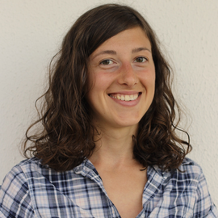

## The company for data-driven mobility solutions for cities of the future.

## Navigation Index
#### 🌿 [What is Commute?](#-mission--vision)
#### ❓ [Why Commute?](#-why-commute)
#### 🔭 [Mission & Vision](#-mission--vision-1)
### Redesign Transportation
#### 🚦 [Transportation Systems](#-transportation-systems-1)
#### ☀️ [Urban Transportation of the Future](#%EF%B8%8F-urban-transportation-of-the-future-1)
#### 🎯 [Commute Workflow](#-commute-workflow-1)
#### 📊 [Scientific Research](#-scientific-research-1)
### Behind Commute
#### 💪 [The Team](#-the-team-1)
#### 📧  [Contact Us](#-contact-us)
#### 📙 [References](#-references-1)

## 🌿 What is Commute?
Our services.

### What service do we deliver?
Commute provides data-driven and scientifically grounded solutions to urban planners and policymakers to build, upgrade, and optimize transportation infrastructures for better livability. The goal of Commute is to develop and utilize state-of-the-art algorithms to enrich urban landscapes by conceiving networks that promote the organic coexistence of humans and transportation.

## ❓ Why Commute?
It is really that simple.

### Why the need for Commute?
Nowadays, urban transportation is becoming an environmental, societal, and economical burden for our lives. Car-centric cities, which are a result of decades of inadequate policy making, dominate the world. New technologies are continually implemented to find safer and more sustainable traveling solutions, but to create long-standing and revolutionary changes in the way humans connect, the problem of transportation should be tackled at its core—the design of transportation infrastructures.
To achieve such a change, we use a scientifically grounded and data-driven approach that allows us to reinvent modern-day transportation.

### Why you should choose Commute
1. **Commute prioritizes you.**
Our goal is to deliver human-centered solutions for transportation. This means that sustainability, safety and inclusivity are taken into account as main performance measures, while also guaranteeing travel efficiency.
1. **Commute is entirely research-driven.**
The solutions provided by Commute are scientifically grounded, and all our results are supported by a rigorous scientific evaluation.
3. **Commute is different, it makes long-lasting changes.**
The idea behind Commute is to reshape human mobility at its foundation, the conception of the network infrastructure. This involves creating original network designs from scratch, revamping transportation infrastructures to achieve better livability (e.g. renovating outdated roads to meet optimality criteria), and optimizing traffic flows on existing urban networks.

## 🔭 Mission & Vision
Our goals.

### Mission
Our mission is to uplift the livability of cities by designing human-centered transportation. To do so, we aim to inform urban planners and policymakers with tailored algorithmic solutions for modern-day transportation networks.
### Vision
Our long-term vision is to empower policymakers with a powerful, reliable, and secure scientific framework that is able to automate the design of cities of the future. Our core values revolve around the concept of a human-centered urban landscape, where transport infrastructures organically integrate with our lives to aid sustainability, safety and inclusion, with the scope to enrich our societies. Our transportation solutions prioritize livability, as a shared condition of well-being for all.

## Redesign Transportation

## 🚦 Transportation Systems
A guide on the elements of transportation systems.

Our goal is to provide assistance to policymakers and urban planners to build better transportation systems. For this reason, we present here a detailed guide on what they consist of **[WIKI, RODRIGUE]**.

### Definitions
**Transportation systems** are the combination of different **transportation modes**. A **transportation mode** is a traveling method that utilizes a specific kind of vehicle (a means of transport), infrastructure, operation, and policy. Modes can operate in air, water, and land, with land serving as our primary focus.

**Land transportation modes** are all land-based transport systems for moving people, goods, and services, which are essential for connecting communities. Land transportation plays a crucial role in urban planning, hence in shaping our societies.

There are two different types of land transport infrastructures:
1. **Rail networks.** Here a vehicle travels along two parallel steel rails that are referred to as a railway or railroad.
2. **Road networks.** Here vehicles utilize roadways. A road is a clearly marked path that connects two or more locations. Roads are named streets when they pass through urban areas, e.g. a city or a village, acting both as a route and as an easement for the use of the urban space. The set of streets builds the Street Networks.

Other transportation elements are:

1. **Means of transport.** Generally speaking, they can be either vehicles or animals. Vehicles (the primary mean of transport) are non-living devices that are used to move people and goods.
2. **Infrastructure.** This is the fixed installation that allows a vehicle to operate.
3. **Operation.** Private transportation is only governed by the vehicle's owner, who also drives the vehicle. Governments or private businesses conduct operations for both public transportation and freight transportation.
4. **Policy.** This deals with creating a system of rules which are developed to attain particular goals pertaining to social, economic, and environmental factors, as well as the operation and performance of the transportation system.

At Commute, we focus on empowering policymakers with scientific tools to create better transportation infrastructures where the operation of diverse transportation means is optimal.

## ☀️ Urban Transportation of the Future
This is how we envision transportation of the future.

We believe that modern-day transportation needs to meet 5 crucial standards for a livable and human-centered future:

  
*The 5 criteria for livable transportation of the future.*

### Sustainability
Since 1990, the constant increase in car ownership has steadily incremented Green House Gases (GHG) emissions derived from transport. These emissions peaked at 8.7 GtCO2e (Giga Tonnes of CO2 equivalent) in 2019, with 72% percent of transportation emissions coming from roads.
The EU is legally bound **[EU]** to meet Carbon neutrality by 2050. In order to achieve this goal, its interim emission reduction target for 2030 is to decrease the current GHG emission by at least 55%. The only solution for modern-day urban transportation to meet these goals is for them to reduce dependencies (and ultimately not rely upon) the world's natural resources such as coal, oil, and gas. Sustainable urban networks are crucial for the future of humanity.

*Contribution of transport to Global Green House emissions in 2019.* *Notes: Notes: CO2 = carbon dioxide; GHG = greenhouse gas; GtCO2e = gigatonnes of carbon dioxide equivalent.* *Source:* **[BOEHM, MINX]***.*

### Safety & inclusivity
The Global status report on road safety **[WHO]**, launched by the World Health Organization in December 2018 shows that the number of annual road traffic deaths had reached 1.35 million. Road traffic crashes are the leading cause of death of people aged between 5 and 29 years.
Moreover, the current state of car-centric urban transportation is a major cause of societal inequality. As an example, in the U.S. people of color own substantially fewer cars (up to -14.5%) than white people **[US]**. Inadequate and scattered investments in public transport will only worsen the situation, and will not allow for achieving fair living standards for all.
In light of these data, modern urban transport needs to be made safe and inclusive for all.

### Efficiency
Our goal is to integrate the compelling obligations of sustainability, safety, and inclusivity into efficient transport. The two key steps to achieve efficiency by redesigning transport networks are:
1. reducing the need for travel by connecting people and infrastructures with improved urban design (e.g. creating hubs);
2. shifting from car-centric networks to infrastructures where bikes, pedestrians, and public transport are predominant means of transport.

### Cohesiveness
A crucial constraint that our urban networks need to meet is Cohesiveness **[CROW]**. This concept can be operationalized into a scientific framework. It consists of the union of three desiderata:
Directness **[FOLCO]**: how far should a user travel to move from its origin to its destination with a desirable means of transport? This needs to be minimized.
Connectedness **[FOLCO]**: are users able to reach any destination safely? We need to answer this positively.
Robustness: is the transport infrastructure resilient to road jamming and breakage? We need to answer this positively.

### Economical Competitiveness
Recent studies **[SZELL]** show that cycling networks, which are a promising solution to unsustainable urban transport systems, need to (goal 1) be developed with the right growth strategy, and, crucially, (goal 2) be funded persistently while avoiding as much as possible scattered investments. To achieve these goals and to have a low economical burden on societies, at Commute we want to create a platform for making coordinated investments to improve the transport infrastructure as a whole, i.e. with several coexisting means of transportation.

## 🎯 Commute Workflow
Our workflow: data-driven solutions tailored to clients' requests.

The workflow we adopt is made of 6 circular steps:

 
*Our workflow.*

The circular and compartmentalized workflow of Commute allows us to deliver tailored solutions to each client request while also guaranteeing an efficient and high-level work pipeline.

**The forward pass: from clients to software development**

**Step 1.** When getting in contact with Commute, a Client initiates the first step of the workflow. Each client can make different types of requests dealing with redesigning urban transportation infrastructures at any time of their life cycle. Examples are (1) the evaluation of transport infrastructures to meet safety or sustainability desiderata; (2) the design of urban transportation networks from scratch; and (3) the optimization of traffic flows on pre-existing infrastructures.

**Step 2.** Each client request is answered by our Representatives. At this stage, our team is in charge of collecting all the necessary data (which can be optionally provided by the clients) to provide a comprehensive initial evaluation of the benefit granted by Commute's solutions.

**Step 3.** Once the initial evaluation is done, the client request gets transferred to our Research Team which is in charge of the scientific operazionalization of the problem. This consists in translating the initial problem assessment into a rigorous mathematical formulation. This problem is then tackled with state-of-the-art scientific methods.

**Step 4.** The scientific framework is algorithmically implemented by our Software Development Team, which is in charge of: (1) collecting all the data necessary for high-quality results, (2) building a code toolbox to address the client case study and (3) producing the analysis outputs.

**The backward pass: from software development to tailored policies**

**Step 5.** Once our software returns an output, the Research Team is in charge of the scientific evaluation. This consists of (1) a post-processing phase where a thorough statistical analysis allows us to evaluate the effectiveness of our solutions, and (2) the formulation of an urban transportation policy.

**Step 6.** In the last stage of the workflow, the Representatives meet again with the client. Here, we present a portfolio with our solutions and we agree with the client upon a periodic quality assessment of our mobility solutions.

**(Back to) Step 1.** The client.

## 📊 Scientific Research
Our scientific publications.

- [Revealing the similarity between urban transportation networks and optimal transport-based infrastructures](https://arxiv.org/abs/2209.06751) D Leite, C De Bacco arXiv:2209.06751 (2022)

- [Community Detection in networks by Dynamical Optimal Transport Formulation](https://www.nature.com/articles/s41598-022-20986-y) D Leite, D Baptista, A A Ibrahim, E Facca, C De Bacco Nature Sci. Rep. 12, 16811 (2022)

- [Multicommodity routing optimization for engineering networks](https://www.nature.com/articles/s41598-022-11348-9) A Lonardi, M Putti, C De Bacco Nature Sci. Rep. 12, 7474 (2022)

- [Sustainable optimal transport in multilayer networks](https://journals.aps.org/pre/abstract/10.1103/PhysRevE.105.064302) A A Ibrahim, D Leite, C De Bacco Phys. Rev. E 105, 064302 (2022)

- [Immiscible Color Flows in Optimal Transport Networks for Image Classification](https://arxiv.org/abs/2205.02938) A Lonardi, D Baptista, C De Bacco arXiv:2205.02938 (2022)

- [Designing optimal networks for multicommodity transport problem](https://journals.aps.org/prresearch/abstract/10.1103/PhysRevResearch.3.043010) A Lonardi, E Facca, M Putti, C De Bacco Phys. Rev. Research 3, 043010 (2021)

- [Convergence properties of optimal transport-based temporal networks](https://link.springer.com/chapter/10.1007/978-3-030-93409-5_48) D Baptista, C De Bacco Complex Networks & Their Applications X (2021)

- [Principled network extraction from images](https://royalsocietypublishing.org/doi/10.1098/rsos.210025) D Baptista, C De Bacco R. Soc. Open Science 8, 210025 (2021)

- [Infrastructure adaptation and emergence of loops in network routing with time-dependent loads](https://arxiv.org/abs/2112.10620) A Lonardi, E Facca, M Putti, C De Bacco arXiv:2112.10620 (2021)

- [Optimal Transport in Multilayer Networks for Traffic Flow Optimization](https://www.mdpi.com/1999-4893/14/7/189) A A Ibrahim, A Lonardi, C De Bacco Algorithms 14(7), 189 (2021)

- [Network extraction by routing optimization](https://www.nature.com/articles/s41598-020-77064-4) D Baptista, D Leite, E Facca, M Putti, C De Bacco Nature Sci. Rep. 10, 20806 (2020)

## Behind Commute

## 💪 The Team
Meet the people behind Commute.

 
**Alessandro Lonardi** 
Head, Research Team 
Cofounder 
Max Planck Institute for Intelligent Systems 
[🌐](https://aleable.github.io/)

 
**Daniela Leite** 
Research Team 
Cofounder 
Huawei Technologies, Max Planck Institute for Intelligent Systems 
[🌐](https://is.mpg.de/person/dleite)

 
**Diego Baptista** 
Research Team 
Cofounder 
Max Planck Institute for Intelligent Systems 
[🌐](https://diegoabt.github.io/)

 
**Caterina De Bacco** 
Scientific Advisor 
Cofounder 
Max Planck Institute for Intelligent Systems 
[🌐](https://www.cdebacco.com/)

## 📧 Contact Us
Where can you find us?

To get in touch with us you can click HERE!

Alternatively, below you can find all our contacts.

📧 Email 
🐦 Twitter 
💼 Linkedin 
🐘 Mastodon 
🛠️ [GitHub](https://github.com/Commute-Mobility) 

## 📙 References

**[WIKI]** [https://en.wikipedia.org/wiki/Transport](https://en.wikipedia.org/wiki/Transport) 
**[RODRIGUE]** The Geography of Transport Systems FIFTH EDITION Jean-Paul Rodrigue (2020), New York: Routledge, 456 pages. ISBN 978-0-367-36463-2, [https://doi.org/10.4324/9780429346323](https://doi.org/10.4324/9780429346323) 
**[BOEHM]** Boehm, S., L. Jeffery, K. Levin, J. Hecke, C. Schumer, C. Fyson, A. Majid, J. Jaeger, A. Nilsson, S. Naimoli, J. Thwaites, E. Cassidy, K. Lebling, M. Sims, R. Waite, R. Wilson, S. Castellanos, N. Singh, A. Lee, and A. Geiges. 2022. State of Climate Action 2022. Berlin and Cologne, Germany, San Francisco, CA, and Washington, DC: Bezos Earth Fund, Climate Action Tracker, Climate Analytics, ClimateWorks Foundation, NewClimate Institute, the United Nations Climate Change High-Level Champions, and World Resources Institute, [https://doi.org/10.46830/wrirpt.22.00028](https://doi.org/10.46830/wrirpt.22.00028) 
**[MINX]** Minx, J.C., W.F. Lamb, R.M. Andrew, J.G. Canadell, M. Crippa, N. Döbbeling, P. Forster, et al. 2022. “A Comprehensive and Synthetic Dataset for Global, Regional and National Greenhouse Gas Emissions by Sector, 1970–2018, with an Extension to 2019 [Data Set].” Zenodo, [https://zenodo.org/record/6483002#.Y3z3ZOzMLFw](https://zenodo.org/record/6483002#.Y3z3ZOzMLFw) 
**[EU]** EU Climate Law: MEPs confirm deal on climate neutrality by 2050, [https://www.europarl.europa.eu/news/en/headlines/priorities/climate-change/20210621IPR06627/eu-climate-law-meps-confirm-deal-on-climate-neutrality-by-2050](https://www.europarl.europa.eu/news/en/headlines/priorities/climate-change/20210621IPR06627/eu-climate-law-meps-confirm-deal-on-climate-neutrality-by-2050) 
**[WHO]** Global status report on road safety 2018. Geneva: World Health Organization; 2018. Licence: CC BYNC-SA 3.0 IGO, [https://www.who.int/publications/i/item/9789241565684](https://www.who.int/publications/i/item/9789241565684) 
**[US]** Basav Sen, How the U.S. Transportation System Fuels Inequality, [https://inequality.org/research/public-transit-inequality/](https://inequality.org/research/public-transit-inequality/) 
**[CROW]** CROW, Design manual for bicycle traffic, 2016, [https://crowplatform.com/product/design-manual-for-bicycle-traffic/](https://crowplatform.com/product/design-manual-for-bicycle-traffic/) 
**[FOLCO]** Folco, P., Gauvin, L., Tizzoni, M., & Szell, M. (2022). Data-driven micromobility network planning for demand and safety. Environment and Planning B: Urban Analytics and City Science, 0(0), https://doi.org/10.1177/23998083221135611 
**[SZELL]** Szell, M., Mimar, S., Perlman, T. et al. Growing urban bicycle networks. Sci Rep 12, 6765 (2022), [https://doi.org/10.1038/s41598-022-10783-y](https://doi.org/10.1038/s41598-022-10783-y)

---

© Commute 2022. All rights reserved. 
Powered by [Foam](https://github.com/foambubble).
